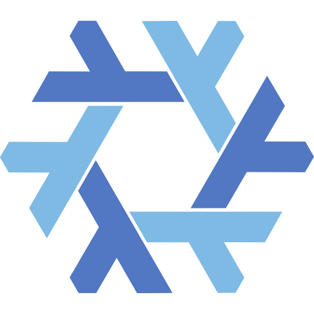

<!-- column_layout: [3, 2] -->

<!-- column: 0 -->
<!-- font_size: 7 -->
Reproducible Builds and why NixOS Matters
<!-- font_size: 5 -->
mmkaram

<!-- column: 1 -->
<!-- alignment: center -->


<!-- reset_layout -->
<!-- end_slide -->

About me
==============

<!-- column_layout: [2, 1] -->

<!-- column: 0 -->

This is some code I like:

```rust
fn potato() -> u32 {
    42
}
```

Things I like about it:
1. Potato
2. Rust
3. The image on the right

<!-- column: 1 -->


_Picture by Alexis Bailey / CC BY-NC 4.0_

<!-- reset_layout -->

Because we just reset the layout, this text is now below both of the columns.

